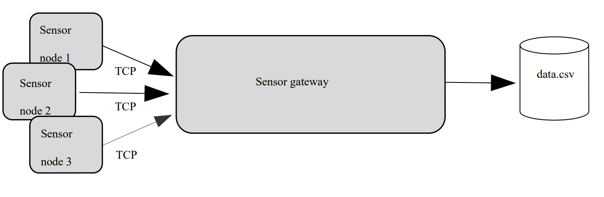
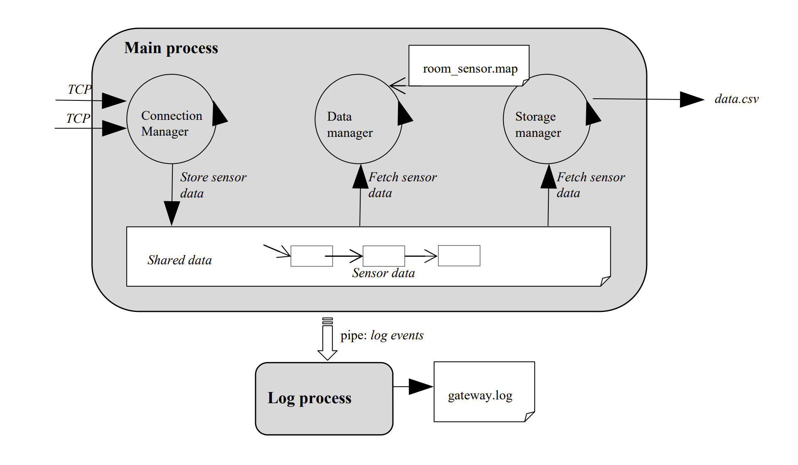

# Multi-threaded sensor monitoring system

The picture below visually sketches this project. The sensor monitoring system consists of client-side sensor nodes measuring the room temperature, and a central server-side sensor gateway that acquires all sensor data from the sensor nodes. A sensor node uses a TCP connection to transfer the sensor data to the sensor gateway. The complete system is depicted below.

<u>**Disclaimer:**</u> This project was a part of the course "Operating Systems" taught at KULeuven. Please <a href="https://onderwijsaanbod.kuleuven.be/2022/syllabi/e/T3WBS2E.htm#activetab=doelstellingen_idp1160656"> <u> click here </u> </a>  for more information regarding the course and its goals. Working with real embedded sensor nodes is not an option for this project. Therefore, sensor nodes will be simulated in software using a client-side sensor-node

# Requirements

1. The sensor gateway consists of a main process and a log process. The log process is started (with fork) as a child process of the main process.
2. The main process runs three threads at startup: the connection manager, the data manager, and the storage manager thread. A shared data structure is used for communication between all threads.
3. The connection manager listens on a TCP socket for incoming connection requests from new sensor nodes. The port of this TCP connection is given as a command line argument at the start-up of the main process, e.g. ./server 1234. For each client-side node communicating with the server, there should be a dedicated thread to process incoming data at the server.
4. The connection manager captures incoming data from sensor nodes. Next, it writes the data to the shared data structure. At compilation time, a time-out is defined in seconds (see Makefile). If the sensor node has not sent new data within the defined time-out, the server closes the connection.
5. The data manager thread implements the server intelligence. The room-sensor mapping is read from a text file “room_sensor.map”. The data manager only reads sensor measurements from the shared in-memory data buffer. It further calculates a running average on the temperature and uses that result to decide on ‘too hot/cold’. It doesn’t write the running average values to the shared data buffer – it only uses them for internal decision-making.
6. The storage manager thread reads sensor measurements from the shared data buffer and inserts them into a CSV file “data.csv”. A new, empty data.csv should be created when the server starts up. It should not be deleted when the server stops.
7. The log process receives log events from the main process using a pipe. All threads of the server process can generate log events and write these to the pipe. This means that the pipe is shared by multiple threads and access to the pipe must be thread-safe.
8. A log event contains an ASCII info message describing the type of event. For each log event received, the log process writes an ASCII message of the format <sequence number> <timestamp> <log-event info message> to a new line in a log file called “gateway.log”. Do not include “<’’ and ‘’>” in the log lines. Each time the server is started, a new empty gateway.log file should be created. Hence, the sequence number should only be unique within one execution of the server. The log file should not be deleted when the server stops.
9. At least the following log events need to be supported:

   <u> A. From the connection manager: </u>
   
   1. Sensor node "sensorNodeID" has opened a new connection.

   2. Sensor node "sensorNodeID" has closed the connection.

   <u> B. From the data manager: </u>

    1. Sensor node "sensorNodeID" reports it’s too cold (avg temp = "value").

    2. Sensor node "sensorNodeID" reports it’s too hot (avg temp = "value").
   
    3. Received sensor data with invalid sensor node ID "node-ID".
   
    <u> C. From the storage manager: </u>

    1. A new data.csv file has been created.

    2. Data insertion from sensor "sensorNodeID" succeeded.
   
    3. The data.csv file has been closed.

